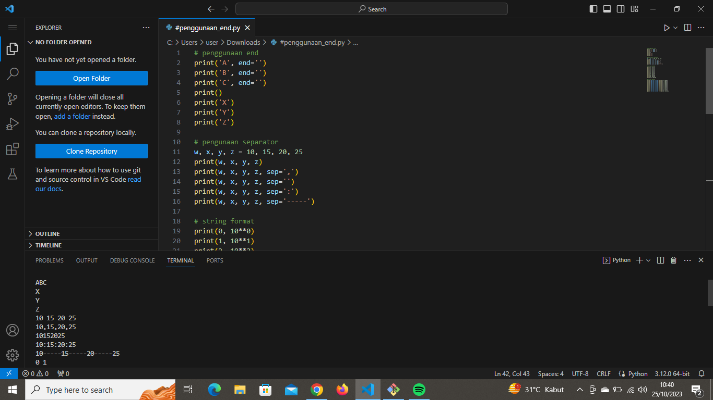
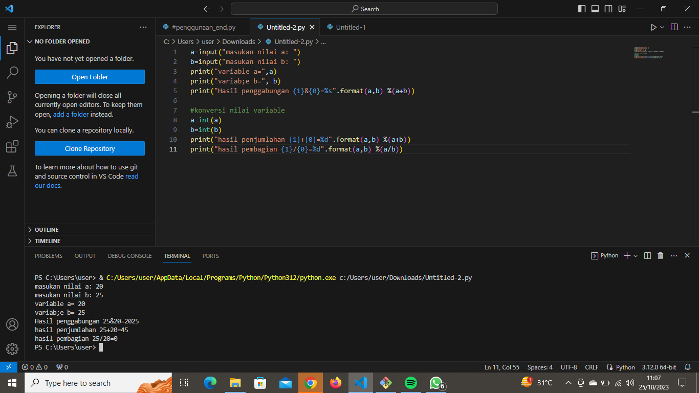
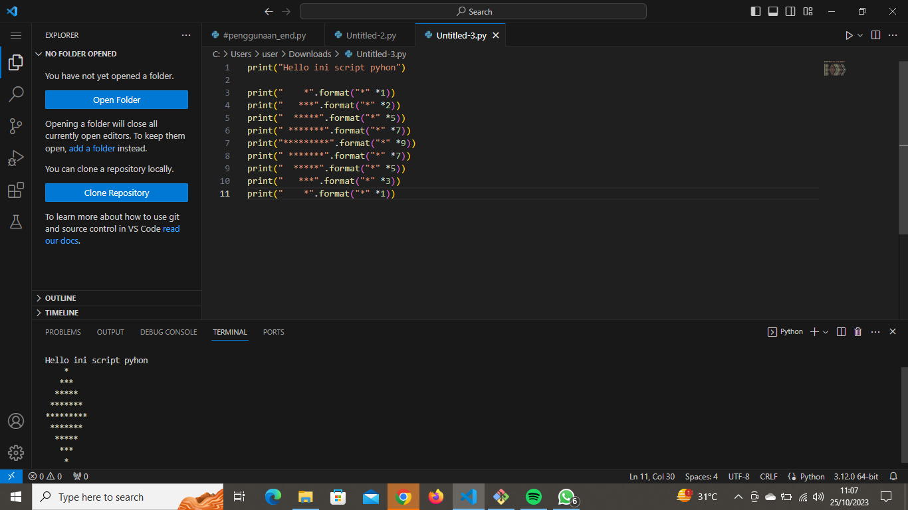
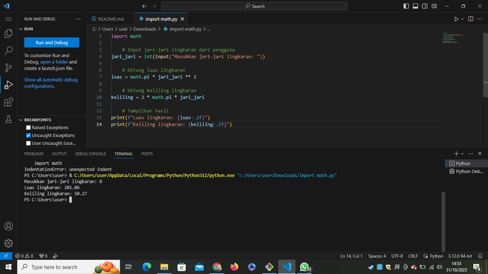
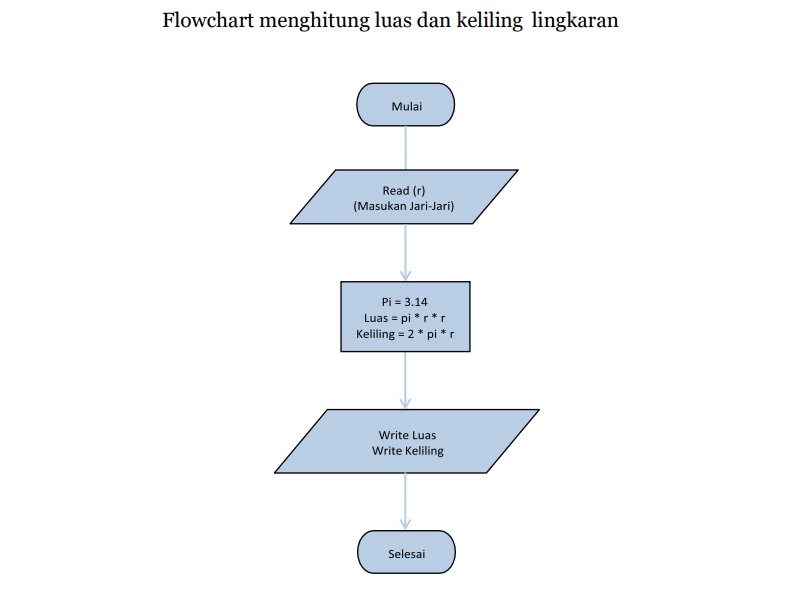

# Praktikum_3
# Praktikum 3
> sebagai Mata Kuliah Bahasa Pemrograman | Universitas Pelita Bangsa

## Laporan Praktikum
### Latihan 1

    # penggunaan end
    print('A', end='')
    print('B', end='')
    print('C', end='')
    print()
    print('X', end='')
    print('Y', end='')
    print('Z', end='')

    # Penggunaan separator
    w, x, y, z = 10, 15, 20, 25
    print(w, x, y, z)
    print(w, x, y, z, sep=',')
    print(w, x, y, z, sep='')
    print(w, x, y, z, sep=':')
    print(w, x, y, z, sep='-----') 

    # string format
    print(0, 10**0)
    print(1, 10**1)
    print(2, 10**2)
    print(3, 10**3)
    print(4, 10**4)
    print(5, 10**5)
    print(6, 10**6)
    print(7, 10**7)
    print(8, 10**8)
    print(9, 10**9)
    print(10, 10**10) 
 
    # string format
    print('{0:>3} {1:>16}'.format(0, 10**0))
    print('{0:>3} {1:>16}'.format(1, 10**1))
    print('{0:>3} {1:>16}'.format(2, 10**2))
    print('{0:>3} {1:>16}'.format(3, 10**3))
    print('{0:>3} {1:>16}'.format(5, 10**5))
    print('{0:>3} {1:>16}'.format(6, 10**6))
    print('{0:>3} {1:>16}'.format(7, 10**7))
    print('{0:>3} {1:>16}'.format(8, 10**8))
    print('{0:>3} {1:>16}'.format(9, 10**9))
    print('{0:>3} {1:>16}'.format(10, 10**10))
* Penggunaan end:
end digunakan untuk menentukan karakter yang harus ditempatkan setelah setiap pemanggilan print(). Secara default, end adalah karakter baris baru (\n), sehingga setiap pemanggilan print() baru akan memulai pada baris yang baru. Dalam kode Anda, Anda mengganti karakter end dengan string kosong '', sehingga outputnya tidak akan pindah ke baris berikutnya setelah mencetak 'A', 'B', dan 'C'. Hasilnya akan terlihat seperti "ABC" di baris yang sama, lalu baris baru setelah mencetak 'X', 'Y', dan 'Z'.
* Penggunaan sep:
sep digunakan untuk menentukan pemisah antara item yang dicetak dalam satu pemanggilan print() yang berisi beberapa argumen. Secara default, sep adalah spasi (' '). Dalam kode Anda, Anda menetapkan sep ke beberapa nilai yang berbeda seperti koma (,), string kosong (''), titik dua (':'), dan string garis pemisah ('-----'). Ini memengaruhi cara item-item dicetak dalam satu baris.
* String Format:
Anda menggunakan format string untuk mengatur tampilan output dalam beberapa kolom. Dalam kode ini, Anda menggunakan format {0:>3} dan {1:>16} untuk mengatur lebar kolom untuk nilai pertama dan kedua dalam baris yang dicetak. Dalam contoh ini, nilai pertama diatur menjadi tiga karakter lebar (dengan tanda '>'), dan nilai kedua diatur menjadi enam belas karakter lebar. Juga, Anda menggunakan eksponensial (10**n) untuk mencetak hasil perpangkatan 10.

>output

### Latihan2

    a=input("masukkan nilai a:")
    b=input("masukkan nilai b:")
    print("Variable a=",a)
    print("Variable b=",b)
    print("Hasil penggabungan {0}&{1}={2}".format(a, b, a+b))

    # konversi nilai variable
    a=int(a)
    b=int(b)
    print("Hasil penjumlahan {0}+{1}={2}".format(a, b, a+b))
    print("Hasil pembagian {0}/{1}={2:.2f}".format(a, b, a/b))

* Pertama, program meminta pengguna untuk memasukkan dua nilai (a dan b) menggunakan fungsi input(). Input pengguna disimpan sebagai string dalam variabel a dan b.
* Kemudian, program mencetak nilai a dan b menggunakan fungsi print(). Ini akan menampilkan nilai yang dimasukkan pengguna.
* Selanjutnya, program mencetak hasil penggabungan nilai a dan b dengan format string. Di sini, {0}, {1}, dan {2} adalah placeholder yang digunakan untuk memasukkan nilai a, b, dan hasil penggabungan a+b ke dalam string. Hasilnya adalah tampilan seperti "Hasil penggabungan a&b=ab", di mana a dan b adalah nilai yang dimasukkan pengguna.
* Setelah itu, program mengonversi nilai a dan b dari string ke tipe data integer menggunakan int(a) dan int(b). Ini memungkinkan Anda untuk melakukan operasi matematika pada nilai-nilai tersebut.
* Program mencetak hasil penjumlahan a+b dan hasil pembagian a/b dengan menggunakan format string yang serupa dengan sebelumnya. Namun, dalam kasus ini, hasil operasi matematika dihitung dan dimasukkan ke dalam string. Anda menggunakan :.2f untuk membatasi hasil pembagian menjadi dua desimal.

>output

### Latihan3

print("Hello ini script pyhon")

print("    *".format("*" *1))
print("   ***".format("*" *2))
print("  *****".format("*" *5))
print(" *******".format("*" *7))
print("*********".format("*" *9))
print(" *******".format("*" *7))
print("  *****".format("*" *5))
print("   ***".format("*" *3))
print("    *".format("*" *1))

* Ini adalah baris pertama dalam script dan mencetak teks "Hello ini script pyhon" ke layar.
* Selanjutnya, kita memiliki beberapa baris yang mencetak pola segitiga bintang:
* Pola dimulai dengan baris pertama yang memiliki 1 bintang dan terus bertambah hingga mencapai 9 bintang di tengahnya, dan kemudian berkurang kembali ke 1 bintang. Spasi digunakan untuk membuat pola bintang tampak seperti segitiga dengan bintang-bintangnya yang tertata dengan baik. Konsepnya adalah untuk mencetak jumlah bintang yang sesuai dengan tinggi dan lebar segitiga yang diinginkan.

>output

### Lingkaran
    import math

    # Input jari-jari lingkaran dari pengguna
    jari_jari = int(input("Masukkan jari-jari lingkaran: "))

    # Hitung luas lingkaran
    luas = math.pi * jari_jari ** 2

    # Hitung keliling lingkaran
    keliling = 2 * math.pi * jari_jari

    # Tampilkan hasil
    print(f"Luas lingkaran: {luas:.2f}")
    print(f"Keliling lingkaran: {keliling:.2f}")

* Import math : memanggil modul matematika bawaan python
* line 4 : membuat variabel untuk mengambil input jari - jari bertipe integer
* line 7 : menghitung luas menggunakan math pi operasi matematika python bertipe data float
* line 10 : menghitung keliling lingkaran dan memanggil input jari-jari
* line 13 : menghasilkan output luas menggunakan f string
* {luas:.2f} : memanggil output dari variabel luas dan keliling berupa float dengan maks output 2 angka setelah koma (.)
* line 14 : menghasilkan output keliling menggunakan f string

>output

### Flowchart

* Masukkan jari-jari lingkaran (r)
* Hitung Luas Lingkaran dengan rumus L = pi * r * r
* Hitung Keliling Lingkaran dengan rumus K = 2 * pi * r 
* Tampilkan Luas Lingkaran
* Tampilkan keliling lingkaran
